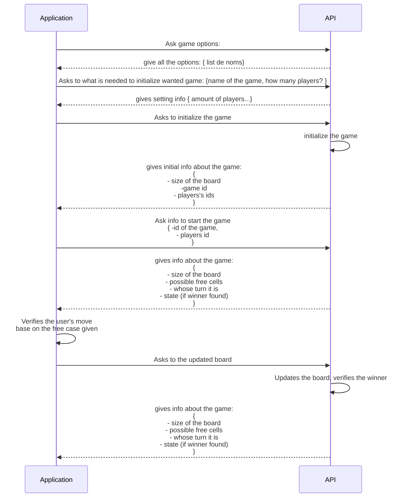

```mermaid
sequenceDiagram
Application ->> API: Ask game options:
API -->> Application : give all the options: { list de noms}

Application ->> API: Asks to what is needed to initialize wanted game: {name of the game, how many players? }
API -->> Application: gives setting info { amount of players...}
Application ->> API: Asks to initialize the game
API ->> API: initialize the game
API -->> Application: gives initial info about the game: <br /> { <br />- size of the board <br /> -game id <br/>- players's ids <br /> }
Application ->> API: Ask info to start the game <br/> { -id of the game, <br /> - players id<br/> }
API -->> Application: gives info about the game: <br /> { <br />- size of the board <br /> - possible free cells <br /> - whose turn it is <br /> - state (if winner found) <br />}
Application ->> Application: Verifies the user's move <br /> base on the free case given
Application ->> API: Asks to the updated board
API ->> API: Updates the board, verifies the winner
API -->> Application: gives info about the game: <br /> { <br />- size of the board <br /> - possible free cells <br /> - whose turn it is <br /> - state (if winner found) <br />}


```